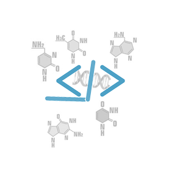

## Biblioteca Bioclass 
 <a href="https://ajudabioclass.onrender.com/"  target="_blank">Site ajuda Bioclass</a> | <a href="https://github.com/paulo-ufmg/Bioclass/blob/main/LICENSE.txt" target="_blank">Licença</a> |
# Bioclass

`	`Bioclass é um projeto gerado em linguagem Python para análise de estruturas em bioinfirmática. Esse projeto se traduz em uma coleção de comandos para operar sobre as estruturas biológicas que podem ser encadeados entre si, baseada na programação orientada a objeto. O código é capaz de identificar o tipos de estruturas, analisar suas características, bem como compará-las entre si. São operações usualmente utilizadas pela comunidade científica da área biológica e da computacional e aberta à contribuição colaborativa de outros pesquisadores.

`	`No Bioclass há duas classes principais, quais sejam: Biprof e encadear. Todos os seus métodos estão listados na documentação do código. Com os exemplos de uso, abaixo listados, ilustramos a versatilidade e potencialidades de muitos desses métodos.

**Exemplo de uso:**

Instala Biblioteca Blosum

!pip install blosum

Collecting blosum Downloading blosum-2.0.3-py3-none-any.whl (21 kB) Installing collected packages: blosum Successfully installed blosum-2.0.3

Criando um novo objeto “obj”do mesmo tipo da classe “Bioprof” para contextualizar os métodos

from Bioclass import Bioprof

obj=Bioprof()

Arquivo de Exemplo “genoma.fasta”

>Humano

ATCGATCGATCG

>Rato

ATAGATCGATCG

>Cachorro

ATCGATGGATCG

>Gato

ATCGATAGATCG

**Método leiaArquivoFasta:**

Lê um arquivo FASTA e armazena as sequências.

obj.leiaArquivoFasta("genoma.fasta")

**Método get_seqs:**

Retorna a lista de IDs de sequências.

obj.get_seqs()

['Humano', 'Rato', 'Cachorro', 'Gato']

**Método get_sequencia:**

Retorna a sequência correspondente a um ID

obj.get_sequencia('Humano')

ATCGATCGATCG

**Método adiciona_seq:**

Adiciona uma nova sequência manualmente

obj.adiciona_seq('Elefante','','ATCAATAGACCG')

**Método get_tamanho_sequencia:**

Calcula o tamanho de uma sequência

obj.get_tamanho_sequencia('Rato')

12

**Método get_tipo_seq:**

Identifica o tipo da sequência (DNA, RNA ou Proteína)

obj.get_tipo_seq('Rato')

DNA

**Método transc_dna2rna:**

Transcreve DNA para RNA

obj.transc_dna2rna('Rato')

AUAGAUCGAUCG

**Método compara_genomas:**

Compara dois genomas e retorna a porcentagem de diferenças

obj.compara_genomas('Cachorro','Gato')

Cachorro : ATCGATGGATCG

Gato : ATCGATGGATCG

8.33%

**Método dH:**

Calcula a distância de Hamming entre duas sequências

obj.dH("Humano","Elefante")

3

**Método matriz_d:**

Matriz de distância para sequências de proteínas

obj.matriz_d()

Alignment between Humano and Rato: ATCGATCGATCG Alignment between Humano and Cachorro: ATCGAT-CGATCG Alignment between Humano and Gato: ATCGATCGATCG Alignment between Humano and Elefante: ATCGATCGATCG Alignment between Rato and Humano: ATAGATCGATCG Alignment between Rato and Cachorro: ATAGAT-CGATCG Alignment between Rato and Gato: ATAGATCGATCG Alignment between Rato and Elefante: AT-AGATCGATCG Alignment between Cachorro and Humano: ATCGAT-GGATCG Alignment between Cachorro and Rato: ATCGAT-GGATCG Alignment between Cachorro and Gato: ATCGATGGATCG Alignment between Cachorro and Elefante: ATCGATGGATCG Alignment between Gato and Humano: ATCGATAGATCG Alignment between Gato and Rato: ATCGATAGATCG Alignment between Gato and Cachorro: ATCGATAGATCG Alignment between Gato and Elefante: ATCGATAGATCG Alignment between Elefante and Humano: ATCAATAGACCG Alignment between Elefante and Rato: ATCA-ATAGACCG Alignment between Elefante and Cachorro: ATCAATAGACCG Alignment between Elefante and Gato: ATCAATAGACCG

**Exemplos de Encadeamento de métodos**

from Bioclass import encadear

seq=encadear()

seq.adiciona_seq("Genoma","teste","CCACCCTCGTGGTATGGCTAGGCATTCAGGAACCGGAGAACGCTTCAGACCAGCCCGGACTGGGAACCTGCGGGCAGTAGGTGGAAT")

**Transcreve a sequência com ID "Genoma" para RNA e imprime o resultado.**

print("Resultado datrancrição de Genoma: ",seq.transc_dna2rna("Genoma"))

Resultado datrancrição de Genoma: CCACCCUCGUGGUAUGGCUAGGCAUUCAGGAACCGGAGAACGCUUCAGACCAGCCCGGACUGGGAACCUGCGGGCAGUAGGUGGAAU

**Encadeia operações de manipulação de sequência, transcrevendo DNA para RNA, traduzindo para proteína e, por fim, imprimindo o resultado final**

seq.dna("Genoma").transcreve().traduz().imprime()

PPSWYG*AFRNRRTLQTSPDWEPAGSRWN

<Bioclass.encadear at 0x7c86c9b2ba60>

